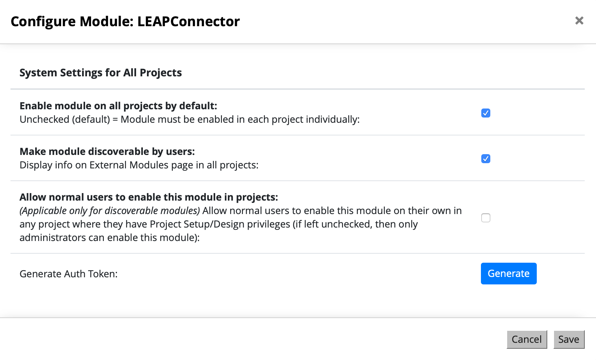
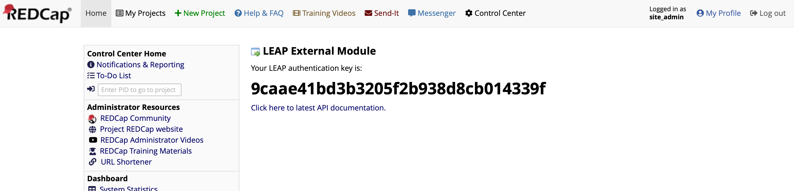

# LEAP-REDCap-External-Module

**Last updated:** 08/28/2020

## Overview
This external module for REDCap enables LEAP to query and retrieve data from REDCap databases.

## Installion Guide

With the help of administrative access to your REDCap instance, do the following:

1. Clone or download this repository: [LEAP-REDCap-External-Module](https://github.com/leap-project/LEAP-REDCap-External-Module)
2. Create a new folder `leap_connector_v0` in REDCap's `modules` folder
3. Move all the files to this new folder

#### Enable module:
1. In REDCap, go to the External Modules section of your system wide control panel
2. Enable the LEAP Connector module
3. LEAP's module requires access to all projects. Open LEAPConnector's Config and give it the permission.

#### Generate an auth token:
1. In LEAP Connector's configuration, click on Generate button

2. You can now visit the LEAP External Module page (under External Modules in the Control Center sidebar) to access your auth key:



## Connect your LEAP site

You can connect to REDCap by adding the following to your Site Algo configuration:
```
"redcap_url": "<REDCap URL>/api",
"redcap_auth": "<AUTH TOKEN>",
"redcap_pid": <Project ID of REDCap>,
"csv_true": "0",
```

## Usage Guide

[Visit the API guide in the LEAP Wiki](https://github.com/leap-project/leap/wiki/REDCap-External-Module-APIs)

