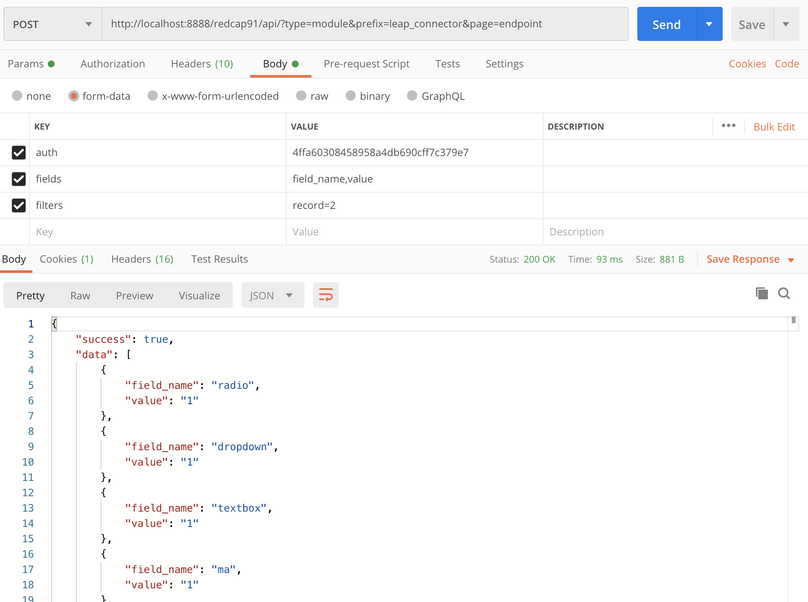

# LEAP-REDCap-External-Module

**Last updated:** 05/19/20

## Overview
This external module for REDCap enables LEAP to query and retrieve data from REDCap databases.

## Installion Guide

### Setup the files:
1. Download this repository. 
2. Create a new folder `leap_connector_v0` in REDCap `modules` folder
3. Move all the files to this new folder

### Enable module:
1. In REDCap, go to the External Modules section of your system wide control panel
2. Enable the LEAP Connector module

### Generate an auth token:
1. In LEAP Connector's configuration, click on Generate button
2. Close the settings window (don't save the settings)
3. Open the config again, you will see the LEAP Auth Token text box populated with the token, which you should copy

## Usage Guide

The URL will be: 

```POST <YOUR-REDCAP-INSTANCE>/api/?type=module&prefix=leap_connector&page=endpoint```

You can query it with the following POST parameters:
1. **auth** - your auth token
2. **filters** - the filters youo want to apply in WHERE clause, eg. record=2

In Postman, this will look like:


